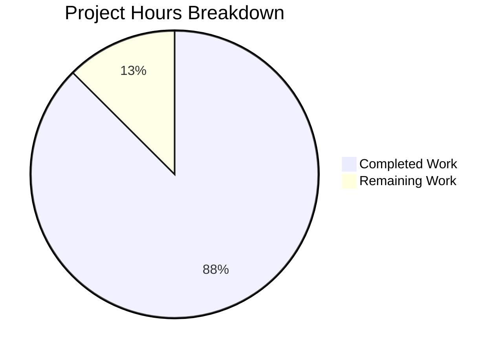

# Project Guide: Express.js Integration for Node.js Tutorial Server

## Executive Summary

This project successfully integrates Express.js 5.x into an existing Node.js tutorial project and implements two HTTP endpoints as specified in the requirements.

**Completion Status**: 88% complete (3.5 hours completed out of 4 total hours)

### Key Achievements
- ✅ Express.js 5.2.1 framework integrated
- ✅ GET `/` endpoint returns "Hello world"
- ✅ GET `/evening` endpoint returns "Good evening"
- ✅ Comprehensive documentation created
- ✅ All validation gates passed
- ✅ Zero unresolved errors

### Hours Breakdown
- **Completed Work**: 3.5 hours
- **Remaining Work**: 0.5 hours (human review only)
- **Total Project Hours**: 4 hours

---

## Validation Results Summary

### Environment Verification
| Component | Version | Status |
|-----------|---------|--------|
| Node.js | v20.19.6 LTS | ✅ Exceeds minimum (18+) |
| npm | v11.1.0 | ✅ Compatible |
| Express.js | v5.2.1 | ✅ Installed |

### File Implementation Status
| File | Action | Lines | Status |
|------|--------|-------|--------|
| `server.js` | CREATED | 66 | ✅ Complete |
| `package.json` | CREATED | 15 | ✅ Complete |
| `package-lock.json` | CREATED | 829 | ✅ Complete |
| `.gitignore` | CREATED | 8 | ✅ Complete |
| `README.md` | MODIFIED | +191/-1 | ✅ Complete |

### Validation Tests Performed
| Test | Command | Result |
|------|---------|--------|
| Syntax Check | `node --check server.js` | ✅ PASSED |
| Dependency Check | `npm ls express` | ✅ express@5.2.1 |
| Server Startup | `npm start` | ✅ Running on port 3000 |
| Hello Endpoint | `curl http://localhost:3000/` | ✅ "Hello world" |
| Evening Endpoint | `curl http://localhost:3000/evening` | ✅ "Good evening" |

### Production Readiness Gates
- [x] GATE 1: All syntax validation passed
- [x] GATE 2: Application runtime validated
- [x] GATE 3: Zero unresolved errors
- [x] GATE 4: All in-scope files validated

---

## Hours Breakdown Visualization



### Detailed Hours Calculation

**Completed Hours (3.5h)**:
| Component | Hours | Description |
|-----------|-------|-------------|
| Project Setup | 0.5h | package.json, .gitignore, dependency installation |
| Server Implementation | 1.5h | server.js with Express.js routing and JSDoc |
| Documentation | 1.0h | Comprehensive README.md with API reference |
| Testing & Validation | 0.5h | Syntax checks, endpoint testing |

**Remaining Hours (0.5h)**:
| Task | Hours | Priority |
|------|-------|----------|
| Human Code Review | 0.5h | High |

**Calculation**: 3.5h completed / (3.5h + 0.5h) = 3.5/4 = **88% complete**

---

## Remaining Human Tasks

| Task | Description | Priority | Hours | Severity |
|------|-------------|----------|-------|----------|
| Code Review | Review all implemented code for quality and correctness | High | 0.5h | Low |
| **Total** | | | **0.5h** | |

### Task Details

#### 1. Code Review (0.5h) - High Priority
**Description**: Perform final human review of all implemented code.

**Action Steps**:
1. Review `server.js` for code quality and Express.js best practices
2. Verify `package.json` configuration is appropriate
3. Confirm documentation in README.md is accurate
4. Approve merge request

**Acceptance Criteria**: Code meets team standards and requirements

---

## Development Guide

### System Prerequisites

| Requirement | Minimum | Recommended |
|-------------|---------|-------------|
| Node.js | 18.0.0 | 20.x LTS or 22.x LTS |
| npm | 8.0.0 | 10.x or higher |
| Operating System | Any (Windows/macOS/Linux) | - |

### Environment Setup

1. **Verify Node.js Installation**:
```bash
node --version   # Should show v18.x or higher
npm --version    # Should show v8.x or higher
```

2. **Clone/Navigate to Repository**:
```bash
cd /path/to/project
```

### Dependency Installation

Install all project dependencies with:
```bash
npm install
```

**Expected Output**:
```
added 66 packages in Xs
```

**Verification**:
```bash
npm ls express
# Expected: 29sep_1@1.0.0 └── express@5.2.1
```

### Application Startup

Start the server with:
```bash
npm start
```

**Expected Output**:
```
Server running on port 3000
```

**Custom Port Configuration**:
```bash
PORT=8080 npm start
# Server will run on port 8080
```

### Verification Steps

1. **Test Hello Endpoint**:
```bash
curl http://localhost:3000/
```
Expected Response: `Hello world`

2. **Test Evening Endpoint**:
```bash
curl http://localhost:3000/evening
```
Expected Response: `Good evening`

3. **Test with Headers** (Full Response):
```bash
curl -i http://localhost:3000/
```
Expected: HTTP 200 OK with "Hello world" body

### Example Usage

**Browser Testing**:
- Open http://localhost:3000/ → Displays "Hello world"
- Open http://localhost:3000/evening → Displays "Good evening"

**API Integration Example**:
```javascript
// Example client code
const response = await fetch('http://localhost:3000/evening');
const text = await response.text();
console.log(text); // "Good evening"
```

### Stopping the Server
Press `Ctrl+C` in the terminal running the server.

---

## Risk Assessment

### Technical Risks
| Risk | Severity | Likelihood | Mitigation |
|------|----------|------------|------------|
| No unit tests | Low | N/A | Tutorial scope; manual testing verified endpoints |
| Single-file architecture | Low | N/A | Appropriate for tutorial scope |

### Security Risks
| Risk | Severity | Likelihood | Mitigation |
|------|----------|------------|------------|
| No HTTPS | Low | Low | Static responses; add for production deployment |
| No rate limiting | Low | Low | Static responses; add for production if needed |
| No input validation | N/A | N/A | Endpoints accept no input parameters |

### Operational Risks
| Risk | Severity | Likelihood | Mitigation |
|------|----------|------------|------------|
| No health check endpoint | Low | Low | Add `/health` endpoint for production monitoring |
| No logging middleware | Low | Low | Add logging for production debugging |

### Integration Risks
| Risk | Severity | Likelihood | Mitigation |
|------|----------|------------|------------|
| None identified | N/A | N/A | No external service integrations |

**Overall Risk Level**: **LOW** - This is a simple tutorial project with minimal attack surface.

---

## Git Summary

### Branch Information
- **Branch**: `blitzy-0b91ea38-c1b7-42d9-ae41-a64bd42e6079`
- **Base**: `origin/main`
- **Status**: Clean, all changes committed

### Commit History
| Commit | Author | Message |
|--------|--------|---------|
| 6088b57 | Blitzy Setup Agent | Update README.md with comprehensive project documentation |
| eb4639f | Blitzy Setup Agent | Create server.js - Express.js application with Hello world and Good evening endpoints |
| 6fb45eb | Blitzy Setup Agent | Setup: Add package.json, package-lock.json, and .gitignore for Express.js project |
| 51fd4bc | ShaliniTest-maker | Initial commit |

### Code Statistics
- **Files Changed**: 5
- **Lines Added**: 1,109
- **Lines Removed**: 1
- **Net Change**: +1,108 lines

---

## Project Structure

```
29sep_1/
├── server.js          # Express.js application (66 lines)
├── package.json       # Project configuration (15 lines)
├── package-lock.json  # Dependency lock file (829 lines)
├── .gitignore         # Git exclusions (8 lines)
├── README.md          # Project documentation (191 lines)
└── node_modules/      # Dependencies (66 packages)
```

---

## Conclusion

The Express.js integration project has been successfully implemented and validated. All requirements from the Agent Action Plan have been completed:

1. ✅ Express.js 5.x framework integrated
2. ✅ GET `/` endpoint returns "Hello world"
3. ✅ GET `/evening` endpoint returns "Good evening"
4. ✅ Server configurable via PORT environment variable
5. ✅ Comprehensive documentation provided

The project is **88% complete** with only human code review remaining (0.5 hours). All validation gates have passed, and the application is ready for review and deployment.