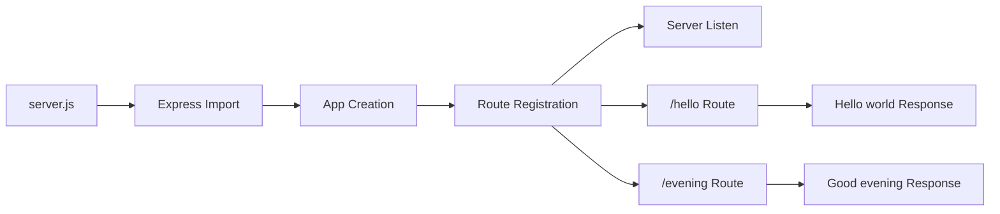
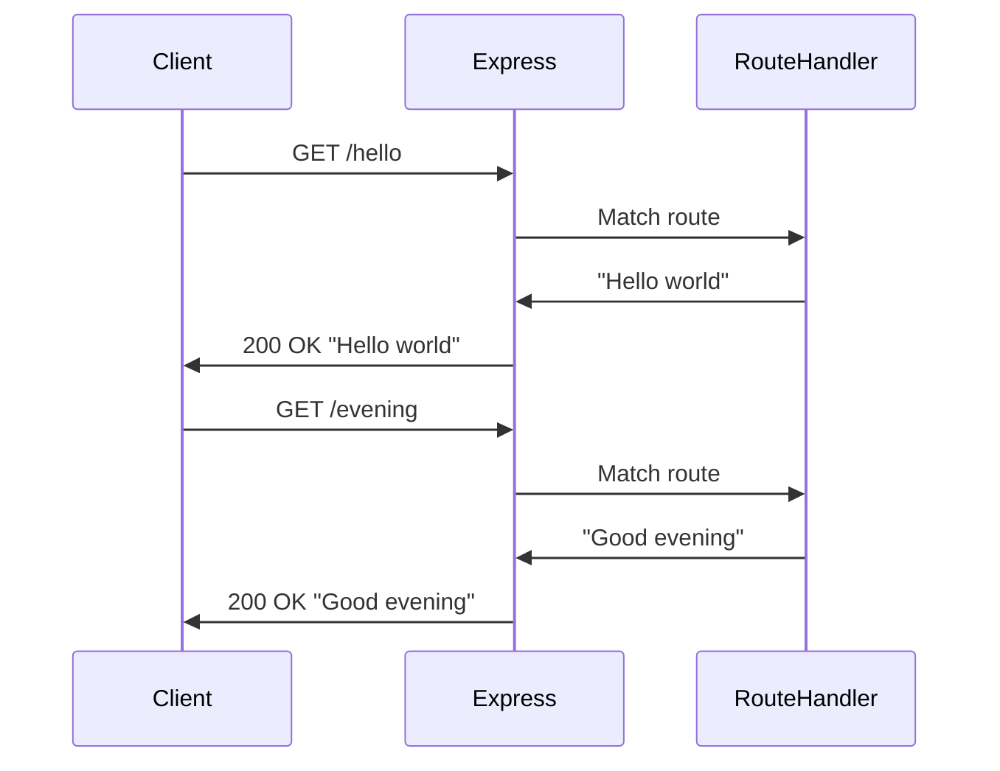

# Technical Specification

# 0. Agent Action Plan

## 0.1 Intent Clarification

Based on the prompt, the Blitzy platform understands that the new feature requirement is to enhance an existing Node.js server project by integrating Express.js as the web framework and adding a new HTTP endpoint. This section provides a precise technical interpretation of the user's requirements.

### 0.1.1 Core Feature Objective

Based on the prompt, the Blitzy platform understands that the new feature requirement is to:

- **Add Express.js Framework**: Integrate Express.js into the existing Node.js project to provide a robust, production-ready web server framework
- **Create New Endpoint**: Implement a new HTTP endpoint that returns the response "Good evening"
- **Maintain Existing Functionality**: Preserve the existing "Hello world" endpoint functionality while enhancing the project structure

**Implicit Requirements Detected**:

- The project requires initialization as a proper Node.js project with `package.json` if not already present
- Express.js installation via npm is required
- The existing "Hello world" endpoint must be migrated to use Express.js routing
- A proper project structure following Express.js conventions should be established
- The server should listen on a configurable port for development and production flexibility

**Feature Dependencies and Prerequisites**:

| Prerequisite | Status | Purpose |
|--------------|--------|---------|
| Node.js Runtime | Required | Express.js requires Node.js 18+ |
| npm Package Manager | Required | For installing Express.js and dependencies |
| package.json | To be created | Project dependency manifest |
| Server entry point | To be created | Main application file (server.js or app.js) |

### 0.1.2 Special Instructions and Constraints

**Specific Directives**:

- Integrate with Express.js framework (explicit requirement)
- Implement two distinct endpoints:
  - Endpoint 1: Returns "Hello world" response
  - Endpoint 2: Returns "Good evening" response
- Maintain backward compatibility with tutorial project structure

**Architectural Requirements**:

- Follow Express.js best practices and conventions
- Use minimal dependencies to keep the tutorial project simple
- Structure code for readability and educational purposes

**User Example** (preserved exactly as provided):
> "This is a tutorial of node js server hosting one endpoint that returns the response 'Hello world'. Could you add expressjs into the project and add another endpoint that return the response of 'Good evening'?"

### 0.1.3 Technical Interpretation

These feature requirements translate to the following technical implementation strategy:

- **To implement the Express.js integration**, we will create a new `package.json` and install Express.js as the primary dependency
- **To create the "Hello world" endpoint**, we will define an Express route handler at a specific path (e.g., `/` or `/hello`) that sends the text response "Hello world"
- **To create the "Good evening" endpoint**, we will define an additional Express route handler at a distinct path (e.g., `/evening`) that sends the text response "Good evening"
- **To enable server execution**, we will create a main entry point file (`server.js`) that initializes Express, registers routes, and starts the HTTP server on a configurable port

| Requirement | Technical Action | Target Component |
|-------------|------------------|------------------|
| Add Express.js | Install via npm, import in server | package.json, server.js |
| Hello world endpoint | Create GET route at `/` or `/hello` | server.js |
| Good evening endpoint | Create GET route at `/evening` | server.js |
| Server initialization | Configure Express app and listen | server.js |


## 0.2 Repository Scope Discovery

This section provides a comprehensive analysis of the repository structure and identifies all files that need to be created or modified to implement the Express.js integration and new endpoint feature.

### 0.2.1 Comprehensive File Analysis

**Current Repository State**:

| Path | Type | Status | Content Summary |
|------|------|--------|-----------------|
| `README.md` | File | EXISTS | Placeholder with project title "# 29sep_1" |

The repository is currently in a minimal state with only a placeholder README.md file. No source code, configuration files, or dependency manifests exist yet.

**Files Requiring Modification**:

| File Pattern | Purpose | Modification Type |
|--------------|---------|-------------------|
| `README.md` | Project documentation | UPDATE - Add project setup and usage instructions |

**New Source Files to Create**:

| File Path | Purpose | Description |
|-----------|---------|-------------|
| `server.js` | Main entry point | Express.js application initialization, route definitions, and server startup |
| `package.json` | Dependency manifest | Node.js project configuration with Express.js dependency |

**New Test Files to Create**:

| File Path | Purpose | Description |
|-----------|---------|-------------|
| `test/server.test.js` | Unit tests | Test coverage for endpoint responses |

**New Configuration Files**:

| File Path | Purpose | Description |
|-----------|---------|-------------|
| `.gitignore` | Git ignore rules | Exclude node_modules and other generated files |

### 0.2.2 Integration Point Discovery

**API Endpoints to Implement**:

| Endpoint | Method | Response | Purpose |
|----------|--------|----------|---------|
| `/` or `/hello` | GET | "Hello world" | Primary greeting endpoint |
| `/evening` | GET | "Good evening" | Secondary greeting endpoint |

**Server Configuration Points**:

- Port configuration (default: 3000, configurable via environment variable)
- Express.js app initialization
- Route middleware registration
- Server listener setup

### 0.2.3 Web Search Research Conducted

**Express.js Current State**:

- Express.js 5.x (latest: 5.2.1) is now the default on npm
- Express.js 5.0 requires Node.js 18 or higher
- Native async/await middleware support added in v5
- Improved error handling with automatic promise rejection passing
- Updated path-to-regexp for enhanced security (ReDoS mitigation)

**Best Practices for Express.js Implementation**:

- Use explicit route definitions for clarity
- Configure appropriate response content types
- Implement basic error handling
- Structure application for scalability even in simple projects

**Node.js Version Requirements**:

- Node.js 18+ required for Express.js 5.x compatibility
- LTS versions (18.x, 20.x, 22.x) recommended for production

### 0.2.4 New File Requirements Summary

**Source Files**:

```
project-root/
├── server.js              # Main Express.js application entry point
├── package.json           # Node.js project manifest with dependencies
├── .gitignore             # Git ignore configuration
├── README.md              # Updated project documentation
└── test/
    └── server.test.js     # Endpoint unit tests (optional)
```

**File Responsibilities**:

| File | Primary Responsibility | Secondary Concerns |
|------|------------------------|-------------------|
| `server.js` | Express app setup, route definitions | Server lifecycle, error handling |
| `package.json` | Dependency declaration, scripts | Project metadata, entry point config |
| `.gitignore` | Exclude build artifacts | Development environment cleanliness |
| `README.md` | Usage documentation | API reference, setup instructions |


## 0.3 Dependency Inventory

This section documents all packages and dependencies required for the Express.js feature addition, including runtime requirements and development dependencies.

### 0.3.1 Runtime Environment Requirements

**Node.js Runtime**:

| Attribute | Specification | Justification |
|-----------|---------------|---------------|
| Runtime | Node.js | Required for Express.js execution |
| Minimum Version | 18.x | Express.js 5.x requirement |
| Recommended Version | 20.x LTS or 22.x LTS | Long-term support, security updates |
| Package Manager | npm | Default Node.js package manager |

### 0.3.2 Private and Public Packages

**Production Dependencies**:

| Registry | Package Name | Version | Purpose |
|----------|--------------|---------|---------|
| npm | express | ^5.2.1 | Web application framework for Node.js - handles HTTP routing and middleware |

**Development Dependencies** (Optional for tutorial scope):

| Registry | Package Name | Version | Purpose |
|----------|--------------|---------|---------|
| npm | nodemon | ^3.1.0 | Development utility for auto-restarting server on file changes |

### 0.3.3 Dependency Updates

**Package.json Creation**:

The following `package.json` structure will be created:

```json
{
  "name": "29sep_1",
  "version": "1.0.0",
  "main": "server.js",
  "scripts": {
    "start": "node server.js"
  }
}
```

**Import Requirements**:

Files requiring Express.js imports:

| File | Import Statement | Usage |
|------|------------------|-------|
| `server.js` | `const express = require('express');` | Create Express application instance |

**Import Transformation Rules**:

| Pattern | Old (Native HTTP) | New (Express.js) |
|---------|-------------------|------------------|
| Server creation | `http.createServer()` | `express()` |
| Route handling | Manual URL parsing | `app.get(path, handler)` |
| Response sending | `res.end()` | `res.send()` |
| Server listening | `server.listen()` | `app.listen()` |

### 0.3.4 External Reference Updates

**Configuration Files to Update**:

| File Pattern | Update Type | Details |
|--------------|-------------|---------|
| `package.json` | CREATE | New dependency manifest with Express.js |
| `.gitignore` | CREATE | Exclude `node_modules/` directory |
| `README.md` | UPDATE | Add installation and usage instructions |

**Documentation Updates**:

| File | Section | Content to Add |
|------|---------|----------------|
| `README.md` | Installation | `npm install` command |
| `README.md` | Usage | `npm start` command |
| `README.md` | API | Endpoint documentation |

### 0.3.5 Version Compatibility Matrix

| Component | Minimum | Recommended | Maximum Tested |
|-----------|---------|-------------|----------------|
| Node.js | 18.0.0 | 20.x LTS | 22.x |
| Express.js | 5.0.0 | 5.2.1 | latest 5.x |
| npm | 8.0.0 | 10.x | latest |

**Express.js 5.x Key Features Used**:

- Modern routing with path-to-regexp 8.x
- Native async middleware support
- Improved error handling
- ES module compatibility


## 0.4 Integration Analysis

This section analyzes how the new Express.js feature integrates with the existing codebase and identifies all touchpoints that require coordination during implementation.

### 0.4.1 Existing Code Touchpoints

**Current State Assessment**:

The repository currently contains only a placeholder `README.md` file. This means:
- No existing server code to modify
- No existing routes to migrate
- Fresh implementation with Express.js as the foundation

**Direct Modifications Required**:

| File | Modification | Location | Description |
|------|--------------|----------|-------------|
| `README.md` | UPDATE | Entire file | Replace placeholder with comprehensive documentation |

**New File Creations Required**:

| File | Integration Point | Purpose |
|------|-------------------|---------|
| `server.js` | Application entry | Express.js app initialization and route definitions |
| `package.json` | Project root | Dependency management and npm scripts |
| `.gitignore` | Project root | Version control configuration |

### 0.4.2 Dependency Injections

**Express.js Application Flow**:



**Service Registration Pattern**:

| Component | Registration Location | Initialization Order |
|-----------|----------------------|---------------------|
| Express app | `server.js` line 1-3 | 1st - Core framework |
| Route handlers | `server.js` line 4-10 | 2nd - Endpoint definitions |
| Server listener | `server.js` line 12-15 | 3rd - Start accepting connections |

### 0.4.3 API Integration Architecture

**HTTP Request Flow**:



**Endpoint Integration Table**:

| Endpoint | HTTP Method | Handler Function | Response Type | Status Code |
|----------|-------------|------------------|---------------|-------------|
| `/` | GET | helloHandler | text/plain | 200 |
| `/evening` | GET | eveningHandler | text/plain | 200 |

### 0.4.4 Database/Schema Updates

**Not Applicable**: This feature addition does not require any database or schema changes. The endpoints return static text responses without data persistence.

### 0.4.5 External Service Integration

**Not Applicable**: This feature addition operates as a standalone HTTP server without external service dependencies. Future enhancements may introduce:
- Environment variable configuration
- Logging services
- Health check endpoints

### 0.4.6 Integration Risk Assessment

| Integration Point | Risk Level | Mitigation Strategy |
|-------------------|------------|---------------------|
| Express.js import | Low | Use well-tested npm package |
| Route registration | Low | Follow Express.js documentation patterns |
| Port binding | Medium | Use configurable port with fallback |
| Error handling | Low | Implement basic error middleware |

**Port Configuration Strategy**:

```javascript
const PORT = process.env.PORT || 3000;
```

This allows flexibility for deployment environments while providing a sensible default for local development.


## 0.5 Technical Implementation

This section provides a file-by-file execution plan for implementing the Express.js feature addition, detailing the specific changes required for each component.

### 0.5.1 File-by-File Execution Plan

**CRITICAL**: Every file listed below MUST be created or modified as specified.

**Group 1 - Core Feature Files**:

| Action | File | Purpose |
|--------|------|---------|
| CREATE | `server.js` | Main Express.js application with route handlers for both endpoints |
| CREATE | `package.json` | Node.js project manifest with Express.js dependency and npm scripts |

**Group 2 - Supporting Infrastructure**:

| Action | File | Purpose |
|--------|------|---------|
| CREATE | `.gitignore` | Exclude `node_modules/` and other artifacts from version control |

**Group 3 - Documentation**:

| Action | File | Purpose |
|--------|------|---------|
| MODIFY | `README.md` | Update with project description, installation, and usage instructions |

### 0.5.2 Implementation Details by File

**File: `server.js`** (CREATE)

Purpose: Main application entry point implementing Express.js server with two endpoints.

Implementation Requirements:
- Import Express.js module
- Create Express application instance
- Define GET route for `/` returning "Hello world"
- Define GET route for `/evening` returning "Good evening"
- Start server listening on configurable port

Code Structure:

```javascript
const express = require('express');
const app = express();
```

Route Definitions:
- Route 1: `app.get('/', (req, res) => res.send('Hello world'));`
- Route 2: `app.get('/evening', (req, res) => res.send('Good evening'));`

---

**File: `package.json`** (CREATE)

Purpose: Node.js project configuration and dependency manifest.

Implementation Requirements:
- Define project name and version
- Specify `server.js` as main entry point
- Declare Express.js as production dependency
- Configure npm start script

Required Fields:

| Field | Value | Purpose |
|-------|-------|---------|
| name | "29sep_1" | Project identifier |
| version | "1.0.0" | Semantic version |
| main | "server.js" | Application entry point |
| scripts.start | "node server.js" | npm start command |
| dependencies.express | "^5.2.1" | Web framework |

---

**File: `.gitignore`** (CREATE)

Purpose: Configure Git to ignore generated files and dependencies.

Required Patterns:

| Pattern | Purpose |
|---------|---------|
| `node_modules/` | Exclude npm packages (regenerated from package.json) |
| `*.log` | Exclude log files |
| `.env` | Exclude environment configuration (if added later) |

---

**File: `README.md`** (MODIFY)

Purpose: Provide comprehensive project documentation.

Sections to Include:

| Section | Content |
|---------|---------|
| Title | Project name and description |
| Prerequisites | Node.js 18+ requirement |
| Installation | `npm install` instructions |
| Usage | `npm start` and endpoint testing |
| API Reference | Endpoint documentation |

### 0.5.3 Implementation Approach Summary

| Phase | Action | Files Affected | Outcome |
|-------|--------|----------------|---------|
| 1 | Initialize Node.js project | `package.json` | Project manifest created |
| 2 | Install dependencies | `package.json`, `node_modules/` | Express.js available |
| 3 | Create server application | `server.js` | Express app with routes |
| 4 | Configure version control | `.gitignore` | Clean repository state |
| 5 | Update documentation | `README.md` | Usage instructions available |
| 6 | Test endpoints | N/A | Verify functionality |

### 0.5.4 Execution Commands

**Project Initialization**:

```bash
npm init -y
npm install express@^5.2.1
```

**Server Startup**:

```bash
npm start
```

**Endpoint Testing**:

```bash
curl http://localhost:3000/
curl http://localhost:3000/evening
```

Expected Responses:
- `/` → "Hello world"
- `/evening` → "Good evening"


## 0.6 Scope Boundaries

This section establishes clear boundaries for what is included and excluded from this feature implementation to prevent scope creep and ensure focused delivery.

### 0.6.1 Exhaustively In Scope

**Source Files**:

| File Pattern | Purpose | Status |
|--------------|---------|--------|
| `server.js` | Express.js application with route handlers | CREATE |
| `package.json` | Project manifest and dependency declaration | CREATE |
| `.gitignore` | Version control exclusion rules | CREATE |
| `README.md` | Project documentation | MODIFY |

**Feature Components**:

| Component | Scope Definition |
|-----------|------------------|
| Express.js Integration | Install and configure Express.js 5.x framework |
| Hello World Endpoint | GET route at `/` returning "Hello world" text |
| Good Evening Endpoint | GET route at `/evening` returning "Good evening" text |
| Server Configuration | Port binding with environment variable support |
| Documentation | README with installation, usage, and API reference |

**Configuration Scope**:

| Configuration | Included | Details |
|---------------|----------|---------|
| `package.json` | Yes | Dependencies, scripts, project metadata |
| `.gitignore` | Yes | node_modules exclusion |
| Port configuration | Yes | Environment variable `PORT` with default 3000 |
| `.env` file | No | Not required for basic implementation |

**API Endpoints Scope**:

| Endpoint | Method | Response | In Scope |
|----------|--------|----------|----------|
| `/` | GET | "Hello world" | ✅ Yes |
| `/evening` | GET | "Good evening" | ✅ Yes |
| Any other paths | Any | N/A | ❌ No |

### 0.6.2 Explicitly Out of Scope

**Features NOT Included**:

| Feature | Reason for Exclusion |
|---------|---------------------|
| Database integration | Not specified in requirements |
| User authentication | Not specified in requirements |
| API versioning | Exceeds tutorial scope |
| Middleware configuration | Beyond basic routing requirements |
| Template rendering | Static text responses only |
| Static file serving | Not requested |
| HTTPS/TLS configuration | Production concern, not tutorial scope |
| Docker containerization | Deployment optimization, not core feature |
| CI/CD pipeline | Infrastructure concern |
| Unit test implementation | Optional for tutorial project |
| Error handling middleware | Beyond basic requirements |
| Request logging | Beyond basic requirements |
| CORS configuration | Beyond basic requirements |
| Rate limiting | Beyond basic requirements |

**Code Areas NOT Modified**:

| Area | Reason |
|------|--------|
| Additional route files | Single-file architecture sufficient |
| Controller separation | Exceeds tutorial complexity |
| Service layer | No business logic required |
| Model definitions | No data persistence |

### 0.6.3 Scope Validation Criteria

**Implementation Completeness Checklist**:

| Criterion | Validation Method | Required |
|-----------|-------------------|----------|
| Express.js installed | `npm ls express` shows version | ✅ |
| Server starts without error | `npm start` exits cleanly | ✅ |
| Hello endpoint responds | `curl /` returns "Hello world" | ✅ |
| Evening endpoint responds | `curl /evening` returns "Good evening" | ✅ |
| Documentation updated | README contains usage instructions | ✅ |

**Acceptance Criteria**:

- Server starts on port 3000 (or configured PORT)
- GET request to `/` returns exactly "Hello world"
- GET request to `/evening` returns exactly "Good evening"
- All responses return HTTP 200 status code
- Project can be installed fresh with `npm install`

### 0.6.4 Boundary Constraints

**Technology Constraints**:

| Constraint | Boundary |
|------------|----------|
| Node.js Version | Minimum 18.x, recommended 20.x LTS |
| Express.js Version | 5.x only (5.2.1 recommended) |
| Package Manager | npm only (yarn/pnpm not configured) |
| Module System | CommonJS (`require`) syntax |

**Response Format Constraints**:

| Endpoint | Format | Exact Response Text |
|----------|--------|---------------------|
| `/` | text/plain | "Hello world" |
| `/evening` | text/plain | "Good evening" |

The response text must match exactly as specified in the user requirements without additional formatting, JSON wrapping, or HTML markup.


## 0.7 Special Instructions

This section captures feature-specific requirements, conventions, and special considerations that must be observed during implementation.

### 0.7.1 Feature-Specific Requirements

**Express.js Integration Requirements**:

| Requirement | Implementation Detail |
|-------------|----------------------|
| Framework Selection | Use Express.js exclusively (no alternative frameworks) |
| Version Selection | Express.js 5.x (latest stable: 5.2.1) |
| Module Import | Use CommonJS `require()` syntax for compatibility |
| Route Definition | Use `app.get()` method for HTTP GET endpoints |

**Response Format Requirements**:

| Endpoint | Exact Response | Notes |
|----------|----------------|-------|
| `/` | `Hello world` | Plain text, no trailing newline |
| `/evening` | `Good evening` | Plain text, no trailing newline |

**User's Original Requirements** (preserved verbatim):
> "This is a tutorial of node js server hosting one endpoint that returns the response 'Hello world'. Could you add expressjs into the project and add another endpoint that return the response of 'Good evening'?"

### 0.7.2 Conventions to Follow

**Code Style Conventions**:

| Convention | Standard |
|------------|----------|
| Variable naming | camelCase |
| Constants | UPPER_SNAKE_CASE for config values |
| Function style | Arrow functions for route handlers |
| Semicolons | Required |
| Quotes | Single quotes for strings |

**Project Structure Convention**:

```
project-root/
├── server.js          # Single-file application (appropriate for tutorial)
├── package.json       # Project configuration
├── .gitignore         # Git exclusions
└── README.md          # Documentation
```

### 0.7.3 Performance and Scalability Considerations

**Tutorial Scope Considerations**:

| Aspect | Recommendation |
|--------|----------------|
| Connection pooling | Not required for tutorial |
| Clustering | Not required for tutorial |
| Caching | Not required for tutorial |
| Load balancing | Not required for tutorial |

**Future Enhancement Path** (out of current scope):

- Add request logging middleware
- Implement health check endpoint
- Add graceful shutdown handling
- Configure production error handling

### 0.7.4 Security Requirements

**Basic Security Measures**:

| Measure | Status | Notes |
|---------|--------|-------|
| Input validation | Not required | Static responses only |
| SQL injection | Not applicable | No database |
| XSS protection | Minimal risk | Plain text responses |
| CORS | Not configured | Optional for future |
| Rate limiting | Not included | Optional for future |
| HTTPS | Not included | Deployment concern |

**Security Notes**:
- Express.js 5.x includes security improvements via updated `path-to-regexp` (ReDoS mitigation)
- No sensitive data handling in current scope
- Environment variable support for port enables secure deployment configuration

### 0.7.5 Testing Recommendations

**Manual Testing Commands**:

```bash
# Start server
npm start

#### Test hello endpoint
curl -i http://localhost:3000/

#### Test evening endpoint
curl -i http://localhost:3000/evening
```

**Expected Test Results**:

| Test | Command | Expected Output |
|------|---------|-----------------|
| Hello endpoint | `curl http://localhost:3000/` | `Hello world` |
| Evening endpoint | `curl http://localhost:3000/evening` | `Good evening` |
| HTTP status | Check response headers | `200 OK` |
| Content-Type | Check response headers | `text/html; charset=utf-8` |

### 0.7.6 Deployment Notes

**Development Environment**:

```bash
# Install dependencies
npm install

#### Start development server
npm start
```

**Production Considerations** (out of scope but noted):

| Consideration | Recommendation |
|---------------|----------------|
| Process Manager | Use PM2 or systemd |
| Port Configuration | Use `PORT` environment variable |
| Logging | Add logging middleware |
| Monitoring | Add health check endpoint |

### 0.7.7 Implementation Checklist

**Pre-Implementation**:
- [ ] Verify Node.js 18+ is installed
- [ ] Verify npm is available
- [ ] Navigate to project directory

**Implementation**:
- [ ] Create `package.json` with `npm init -y`
- [ ] Install Express.js with `npm install express@^5.2.1`
- [ ] Create `server.js` with Express app and routes
- [ ] Create `.gitignore` with `node_modules/` exclusion
- [ ] Update `README.md` with documentation

**Post-Implementation**:
- [ ] Start server with `npm start`
- [ ] Test `/` endpoint returns "Hello world"
- [ ] Test `/evening` endpoint returns "Good evening"
- [ ] Verify no console errors on startup
- [ ] Commit changes to version control


